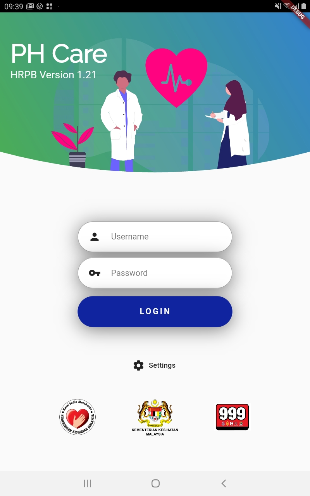
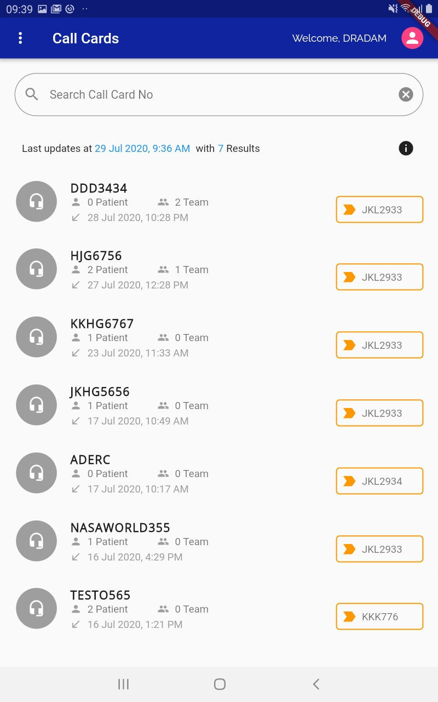
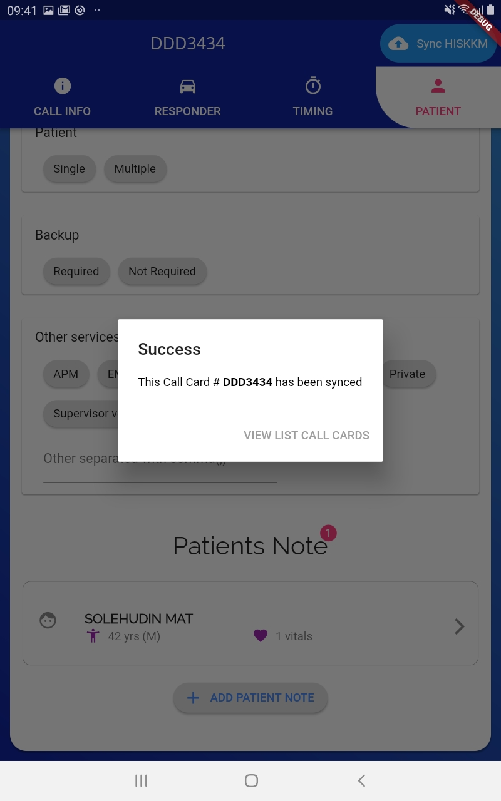

# Phc App
Phc App build with Flutter

Phc App is Pre-Hospital Care Application use by ambulance's responder for taking initial information of a patient
that will synchronize with the hospital system.

Developed for MOH (Ministry of Health)

Final version is 1.21

# Features

  - User may login with HIS (Hospital Information System) credential
  - User can edit information in offline mode where no network available
  - User can resend the information once network available
  - Some additional features e.g., CPR Logs, Vitals, Assessments, Response Team and more are included.
  - User can view last sending information at History screen
  - No limit on patient note created
  - No limit for vital signs recorded
  - The data will synchronized with HIS seamlessly.

# Screenshots

  

